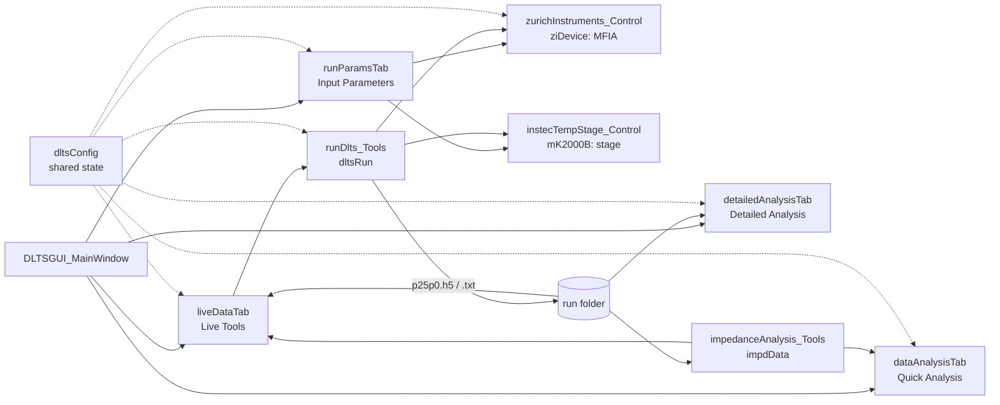

# DLTS control software: documentation

Control and analysis software for deep-level transient spectroscopy on the Hall-probe
stage: a Zurich Instruments MFIA impedance analyzer and an Instec mK2000B temperature
controller, driven from one Tkinter GUI.


## Guides

1. [Getting started](getting_started.md): requirements, installation, starting the GUI,
   repository layout.
2. [Running a DLTS experiment](running_a_dlts_experiment.md): every step in the GUI, from
   parameters to the Arrhenius result.
3. [Quick run examples](quick_run.md): four worked cases on real data, with the
   settings to use and the results to expect.
4. [Standalone instruments](standalone_instruments.md): the stage and the MFIA from
   Python scripts, without the GUI.

All of these pages are also in one PDF, `docs/DLTS_Software_Documentation.pdf`. After
editing the docs, rebuild it with `python docs/build_docs_pdf.py` (needs Microsoft Edge;
it downloads mermaid.js for the diagram below).

## How the parts fit together



## Reference: one page per module

Each page lists the module's constants and globals, every class, method and function
with its parameters and return value, how to call it, and known limitations.

| Module | What it is |
|---|---|
| [DLTSGUI_MainWindow](reference/DLTSGUI_MainWindow.md) | GUI entry point, tab construction, close and room-temperature return |
| [runParamsTab](reference/runParamsTab.md) | Input Parameters tab |
| [liveDataTab](reference/liveDataTab.md) | Live Tools tab: run control, live/offline plots, Qualitative Analysis of the running experiment, transient extractors |
| [dataAnalysisTab](reference/dataAnalysisTab.md) | Quick Analysis tab: Offline Data folder loader, rate windows and Arrhenius |
| [detailedAnalysisTab](reference/detailedAnalysisTab.md) | Detailed Analysis tab: multi-window analysis, maps, weighted fits |
| [runDlts_Tools](reference/runDlts_Tools.md) | `dltsRun`: the run sequence, Redo/Retake, file naming |
| [zurichInstruments_Control](reference/zurichInstruments_Control.md) | `ziDevice`: MFIA parameters, acquisition, file writers |
| [instecTempStage_Control](reference/instecTempStage_Control.md) | `mK2000B`: stage ramps, stabilization, room return |
| [impedanceAnalysis_Tools](reference/impedanceAnalysis_Tools.md) | `impdData`: reading, cleanup, emission selection, denoising, DLTS signals |
| [dltsConfig](reference/dltsConfig.md) | Shared globals, logging, GUI-label conversion |
| [convert_json_to_h5](reference/convert_json_to_h5.md) | JSON run folders to HDF5 |
| [convert_h5_to_text](reference/convert_h5_to_text.md) | One HDF5 step to a readable table or JSON |
| [data_formats](reference/data_formats.md) | Run folders, step files, runParams.txt, HDF5 layout, ZI CSV exports |
| [other_scripts](reference/other_scripts.md) | Legacy apps, tests, benchmarks |

## Checking the software

```
python -m pytest tests -q
```

163 tests, all offline, about 40 s. The real-hardware benchmark and its stored report are
in `benchmarks/hardware/` (latest: `reports/HDF5_Hardware_Benchmark_2026-09-28.pdf`).
