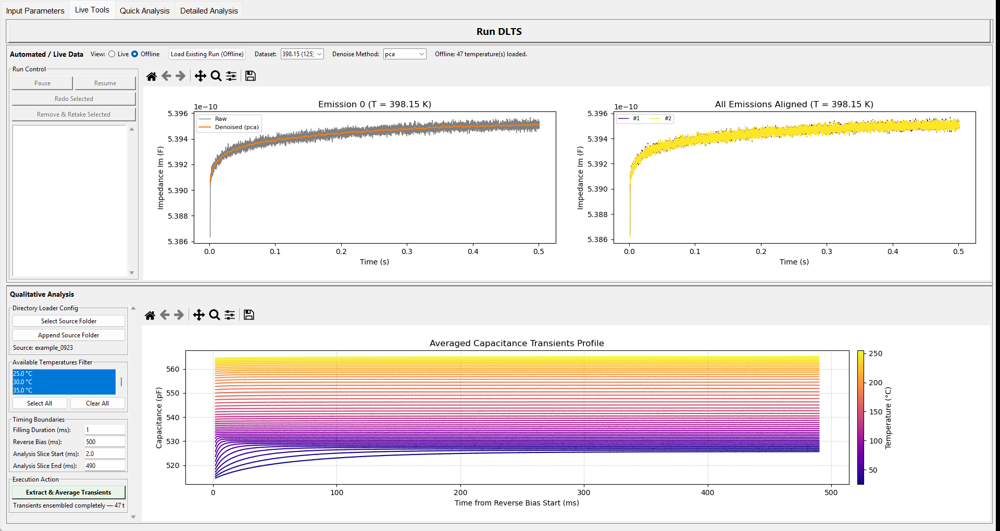
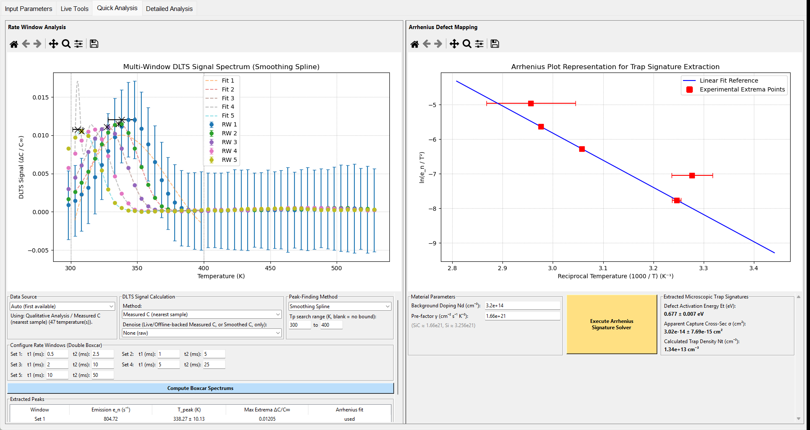
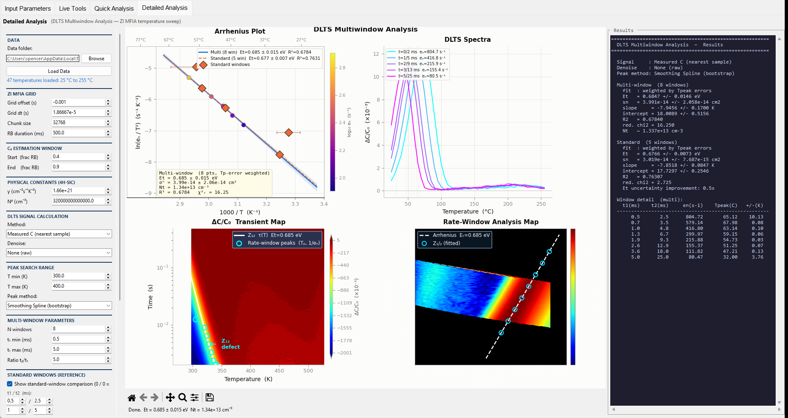
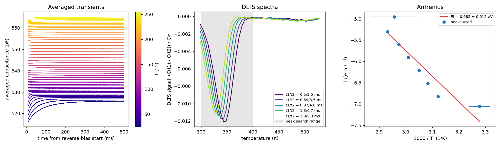
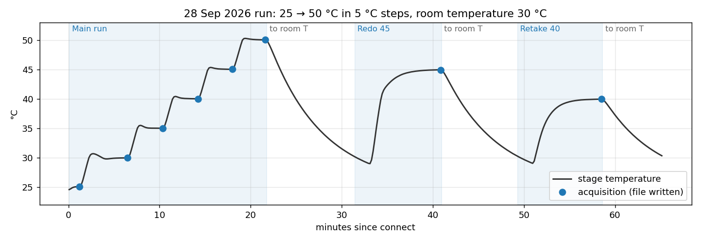
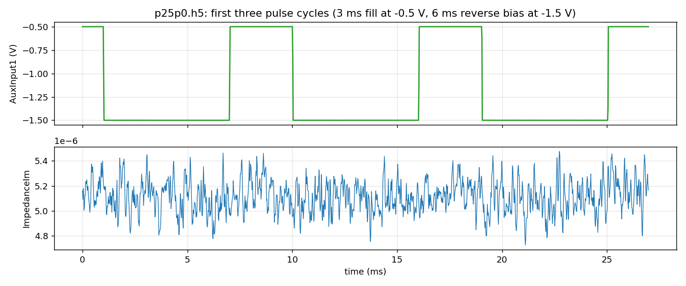

# Quick run examples

Four worked cases on real data from this setup. Each one lists exactly what to set and
what you should see. The figures are screenshots of the GUI, or output of the example
scripts, made from these runs.

| Case | Needs instruments | Time |
|---|---|---|
| [A. Analyze a finished run](#a-analyze-a-finished-run-no-instruments) | No | 5 min |
| [B. A short HDF5 scan](#b-a-short-hdf5-scan-on-the-instruments) | Yes | about 65 min |
| [C. One acquisition from a script](#c-one-acquisition-from-a-script) | MFIA only | 1 min |
| [D. Convert and inspect data files](#d-convert-and-inspect-data-files) | No | 1 min |

---

## A. Analyze a finished run (no instruments)

Data: the 23 Sep 2026 run, `C:\Users\spencer\Desktop\DATA\DLTS\092326\101901`. It has
47 setpoints from 25 °C to 255 °C in 5 °C steps, 2^16 points × 100 reps, 1 ms fill at
0 V and 500 ms reverse bias at −5 V. It was written as JSON (`.json`, 651 MB).

**1. Convert it to HDF5 (optional, recommended).** The Qualitative and Detailed tabs read
`.txt`, `.h5` and `.csv` step files, not `.json`. Converting a copy gives `.h5` files
that every tab reads and that load about 25× faster:

```
python convert_json_to_h5.py "D:\copy\101901" --keep-json
```

```
D:\copy\101901: 47 step file(s)
Converted 47 file(s): 651.5 MB of JSON -> 92.6 MB of HDF5. Skipped 0, failed 0.
```

It took 10 s. Every file is read back and compared value by value before the JSON is
touched; `--keep-json` leaves the originals in place.

**2. Live Tools → Load Existing Run (Offline).** Select all 47 `.h5` files. After
loading, pick **Dataset** `398.15 (125)`: the upper plots show emission 0 raw and PCA
denoised, and all emission blocks aligned.

**3. Qualitative Analysis → Select Source Folder** → the converted folder. The log shows
`Timing Boundaries set from runParams.txt (fill 1 ms, reverse bias 500 ms)`. Press
**Extract & Average Transients**.



The lower plot shows one averaged transient per temperature, colored by temperature. The
fast recovery at the low temperatures (dark curves) is the trap emission. It speeds up
with temperature and leaves the window above about 90 °C.

**4. Quick Analysis.** Set the five rate windows to t1/t2 = `0.5/2.5`, `1/5`, `2/10`,
`5/25`, `10/50` ms and the **Tp search range** to `300` – `400` K. Press
**Compute Boxcar Spectrums**, then **Execute Arrhenius Signature Solver** (defaults
Nd = 3.2e14 cm⁻³, γ = 1.66e21).



Result: **Et = 0.677 ± 0.007 eV**, σ = 3.0e-14 ± 7.7e-15 cm², Nt = 1.3e13 cm⁻³, all
5 windows used.

With the default windows (5/25 up to 100/490 ms) the two slowest windows peak at the very
first setpoint (298 K), on the edge of the search range. Those peaks get no T_peak error,
the **Arrhenius fit** column marks them `excluded (edge peak)`, and the fit uses the other
three: Et = 0.708 ± 0.009 eV. Faster windows move the peaks to 305–338 K, inside the scan,
so all of them count. When the peaks crowd one end of the scan, change the windows first.

**5. Detailed Analysis.** **Browse** to the folder, keep **RB duration** 500 ms,
**Load Data**. Set **N windows** 8, **t₁ min** 0.5, **t₁ max** 5, ratio 5,
**T min/max** 300/400 K, standard windows 0.5/2.5, 1/5, 2/10, 5/25, 10/50. **Run Analysis**.



Result: **Et = 0.685 ± 0.015 eV** (8 windows, weighted by the peak-temperature errors),
σ = 4.0e-14 cm², Nt = 1.3e13 cm⁻³. The **Standard** block (the same 5 windows as step 4)
gives 0.6766 ± 0.0073 eV, σ = 3.02e-14 ± 7.69e-15 cm² and Nt = 1.34e13 cm⁻³: the same
numbers as Quick Analysis, because both tabs run the same functions on the same
transients (see [Matching Detailed Analysis](reference/dataAnalysisTab.md#matching-detailed-analysis)).

**The same analysis as a script** (no GUI):

```
python examples/analyze_run.py "D:\copy\101901" --t1-min 0.5 --t1-max 5 --n-windows 8 --tp 300 400 --png summary.png
```

```
47 temperatures, 25 to 255 C, reverse bias 500 ms
Et = 0.685 +/- 0.015 eV   sigma = 3.99e-14 cm^2   Nt = 1.34e+13 cm^-3   (8 windows used, R2 = 0.678)
```



It uses the Detailed Analysis tab's own functions (`_load_detailed_data`,
`_compute_detailed_analysis`), so the numbers are the same.

---

## B. A short HDF5 scan on the instruments

This is the 28 Sep 2026 validation run. The stage is heated to 50 °C and the sample is
biased; check both are safe.

**Input Parameters:**

| Group | Settings |
|---|---|
| Impedance analyzer | all defaults (6 ms reverse bias, 3 ms fill, Aux −0.5 V / −1.5 V) → **Connect + Get Params**, **Apply + Push Params** |
| Temperature | Initial 25, Final 50, Step 5, Ramp 5, Stability Delay 0, Room Temperature 30, Room Ramp 10 → **Connect + Get Params**, **Apply + Push Params** |
| Output | Points 18, Reps 100, Data File Format **HDF5**, Data Root Folder `C:\Users\spencer\Desktop\DATA\DLTS` → **Apply + Push Params** |

**Live Tools → Run DLTS.** Afterwards, from room temperature: select 45 °C →
**Redo Selected**; select 40 °C → **Remove & Retake Selected**.



What to expect:

- six steps in about 22 minutes; the 30 °C step takes longest because its stability
  tolerance is the tightest (0.027 °C);
- each acquisition about 33 s, each HDF5 file 8.7 MB, written in 0.15 s;
- after every run and after each Redo/Retake, the stage returns to 30 °C (8–10 min
  passive cooling from 45–50 °C);
- the folder `...\DLTS\092826\114655\` with `p25p0.h5` ... `p50p0.h5` and `runParams.txt`.

One step's raw data (`p25p0.h5`):



With these default MFIA settings there is no clear emission in this sample; the run
checks the software, not the sample. The same scan as a script, including the checks
and a report, is `benchmarks/hardware/hw_run.py`. Its stored report is
`benchmarks/hardware/reports/HDF5_Hardware_Benchmark_2026-09-28.pdf`.

---

## C. One acquisition from a script

At the current stage temperature, with no ramp. The MFIA biases the sample.

```
python examples/standalone_impedance.py --out C:\temp\test_acq.h5 --points 18 --reps 100
```

It connects, calls `ziDevice.configure()` (GUI defaults plus any `--enable`,
`--disable`, `--scale`, `--offset` overrides), takes one triggered acquisition, writes it
with `writeDataH5()` and plots the Aux input and ImpedanceIm (as in the figure in
case B). One call takes about 13–15 s: about 5 s of data for 2^18 points (the 100
repetitions overlap, 9 ms apart) plus about 7.5 s of fixed waits in `pull_data()`.

Stage only (read, or ramp and wait):

```
python examples/standalone_temperature.py
python examples/standalone_temperature.py --goto 30 --ramp 5
```

Both instruments, a bare scan without the GUI's pause/redo:

```
python examples/standalone_scan.py --folder C:\temp\scan1 --start 25 --stop 50 --step 5 --room 30
```

See [Standalone instruments](standalone_instruments.md).

---

## D. Convert and inspect data files

**Old JSON runs to HDF5**, whole data tree, originals moved into `json_originals\`:

```
python convert_json_to_h5.py --recursive "C:\Users\spencer\Desktop\DATA\DLTS" --dry-run
python convert_json_to_h5.py --recursive "C:\Users\spencer\Desktop\DATA\DLTS"
```

**One HDF5 step to readable text**: Input Parameters → **Export HDF5 File...**, or

```
python convert_h5_to_text.py "C:\Users\spencer\Desktop\DATA\DLTS\092826\114655\p25p0.h5"
```

It writes `p25p0_export.txt` (35.9 MB, about 3 s for 2^18 points):

```
# DLTS step exported from p25p0.h5
# acquired_at: 2026-09-28T11:48:02
# format_version: 1
# run_params: {"Oscillation Amplitude": 0.3, "Oscillation Frequency": 501000.0, ...}
# setpoint_C: 25.0
# stage_temperature_C: 25.06325
# 262144 rows; columns are tab-separated, empty cells mean a shorter channel
timeStampImps	timeStampDemods	tickStampImps	tickStampDemods	ImpedanceRe	ImpedanceIm	AbsZ	AuxInput1
0.0	0.0	0.0	0.0	0.08808358165588324	5.1615895110309485e-06	0.08808358180711465	-0.4995596262122852
```

The table opens in Excel or Origin. Use `--format json` (or save as `.json` in the GUI)
for a JSON file with the same attributes and channels. Names like `p25p0.txt` are refused,
because the analysis tabs would read such a file as a step of the run.
