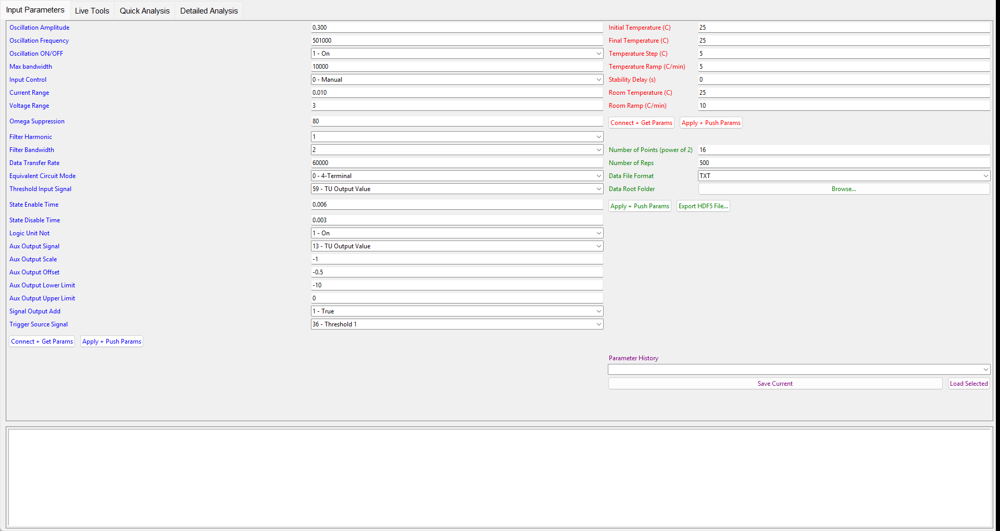

# Running a DLTS experiment

This is the normal way to measure: everything through the GUI. It takes you from a
mounted sample to a folder of step files and an Arrhenius result. For scripts
without the GUI see [Standalone instruments](standalone_instruments.md).

**Safety.** A run heats and cools the stage and applies the pulse bias to the mounted
sample. Check the sample, the wiring and the temperature range first.

## 1. Before you start

1. Mount and wire the sample. Switch on the MFIA and the Instec controller.
2. Start LabOne's data server (it normally runs as a service) so the MFIA can be found.
3. Start the GUI: `python DLTSGUI_MainWindow.py`.

## 2. Set the parameters (Input Parameters tab)

The tab has three groups. Every field starts at the default shown.

### Impedance analyzer (blue, left)

These go to the MFIA. The ones that shape the DLTS pulse:

| Field | Default | What it does in a DLTS run |
|---|---|---|
| State Enable Time | `0.006` s | **Reverse-bias duration.** The transient is recorded during this time. |
| State Disable Time | `0.003` s | **Fill-pulse duration.** |
| Aux Output Scale | `-1` V | Pulse height. The Aux output is `Offset` during the fill pulse and `Offset + Scale` during reverse bias. |
| Aux Output Offset | `-0.5` V | Fill-pulse level. Defaults give fill −0.5 V, reverse bias −1.5 V. |
| Aux Output Lower / Upper Limit | `-10` / `0` V | Clamp on the Aux output. |
| Oscillation Frequency / Amplitude | `501000` Hz / `0.300` V | Test signal for the impedance measurement. |
| Trigger Source Signal | `36 - Threshold 1` | Each pulse triggers one acquisition row; keep the default. |

A typical DLTS setting from earlier runs on this setup: State Enable Time `0.5`,
State Disable Time `0.001`, Aux Output Scale `-5`, Offset `0`, Upper Limit `5`
(1 ms fill at 0 V, 500 ms reverse bias at −5 V). Every parameter, its device node and
its options are in [zurichInstruments_Control](reference/zurichInstruments_Control.md)
and [runParamsTab](reference/runParamsTab.md).

Press **Connect + Get Params** (blue) to connect to the MFIA, then
**Apply + Push Params** (blue) to send the values. After changing a value later, press
**Apply + Push Params** again. A run uses the last pushed values.

### Temperature controller (red, top right)

| Field | Default | Meaning |
|---|---|---|
| Initial Temperature (C) | `25` | First setpoint |
| Final Temperature (C) | `25` | Last setpoint (always included, even if the span is not a multiple of the step) |
| Temperature Step (C) | `5` | Setpoint spacing |
| Temperature Ramp (C/min) | `5` | Ramp rate between setpoints |
| Stability Delay (s) | `0` | Extra wait after the stage is stable (whole seconds) |
| Room Temperature (C) | `25` | Where the stage goes after every run, on errors, and when the GUI closes |
| Room Ramp (C/min) | `10` | Ramp rate for that return |

Press **Connect + Get Params** (red), then **Apply + Push Params** (red).

A step counts as stable when the stage reading is within a tolerance of the setpoint
(`mK2000B.expected_del_t`), confirmed again 10 s later:

| Setpoint (°C) | 25 or below | 30 | 50 | 100 | 150 | 200 | 250 | 300 |
|---|---|---|---|---|---|---|---|---|
| Tolerance (°C) | 0.10 | 0.027 | 0.08 | 0.21 | 0.34 | 0.48 | 0.61 | 0.74 |

Below 0 °C the tolerance grows again (0.29 °C at 0 °C, 1.0 °C at −50 °C). There is
no time limit on stabilizing: a stage that cannot reach the tolerance waits
indefinitely (close the GUI to abort; it then returns to room temperature). A
controller that stops answering is different: each reading times out after 2 s and is
asked once more, then the step fails with `temperature controller on COM7 did not answer
the temperature query` in the log, and the run stops as described under step 3.

### Output (green, middle right)

| Field | Default | Meaning |
|---|---|---|
| Number of Points (power of 2) | `16` | Samples per step = 2^N. At the MFIA's 18.67 µs sample period: 16 → 1.22 s, 18 → 4.89 s of data. |
| Number of Reps | `500` | Triggered repetitions averaged on the MFIA per step |
| Data File Format | `TXT` | `TXT` (JSON text, `.txt`) or `HDF5` (`.h5`, about 7× smaller, much faster to analyze) |
| Data Root Folder | none | **Browse...** to pick it (required: **Run DLTS** refuses to start without it). Each run creates `Root\MMDDYY\HHMMSS\`. |

Press **Apply + Push Params** (green). **Export HDF5 File...** converts one `.h5` step
into a readable `.txt` table or `.json` for inspection (see
[convert_h5_to_text](reference/convert_h5_to_text.md)).

**Parameter History** keeps the last five parameter sets (**Save Current** /
**Load Selected**).

## 3. Run (Live Tools tab)

Press **Run DLTS**. For each setpoint the run:

1. ramps to the setpoint and waits until stable,
2. re-pushes any MFIA parameter that no longer matches (after a factory reset from the
   second step on),
3. reads the stage temperature, acquires 2^N points averaged over the repetitions,
   reads the stage again,
4. writes the step file (`p25p0.h5`; negative setpoints `n10p0.h5`). HDF5 files also
   store the setpoint, the mean measured stage temperature, the acquisition time and
   all run parameters.

When the last step is done it writes `runParams.txt` and returns the stage to Room
Temperature. Typical times on this setup with 5 °C steps at 5 °C/min: 3–5 min per step
(ramp plus stabilization) and about 33 s per acquisition of 2^18 points × 100 reps.

While it runs:

- **Automated / Live Data** plots each new file as it appears: Emission 0 (raw and
  denoised) and All Emissions Aligned, for the temperature chosen in **Dataset**.
- **Run Control** lists every step with its status (pending, running, done, failed).
  **Pause** stops after the current step; **Resume** continues. After a pause or at the
  end, select steps and press **Redo Selected** (overwrites those files) or
  **Remove & Retake Selected** (deletes them first). Steps are always re-measured in
  ascending temperature order.
- The log box on the Input Parameters tab shows every action and warning.

If a step fails (an instrument error, or a file that cannot be written), the run
stops, the step is marked failed, earlier files are kept, and the stage returns to room
temperature. Resume/Redo/Retake stay available.

## 4. Look at the transients

### During the run (Qualitative Analysis, lower part of Live Tools)

The Qualitative Analysis frame follows the running experiment; it does not load saved
folders. When the run writes its first step file, the frame takes the run folder as its
data (**Live Run** shows `Run folder: <name>`), selects every step and extracts it. While
**Follow live run (auto-update)** is checked, each new step, and each step rewritten by
Redo or Remove & Retake, is extracted as soon as its file is written.

- **Timing Boundaries**: **Reverse Bias (ms)** sets the length of each averaged
  transient. When the run folder already has a `runParams.txt` (after a completed main
  sequence), the fields are set from it (reverse bias = State Enable Time, fill = State
  Disable Time). **Analysis Slice End** follows Reverse Bias (98 %) until you type your
  own value.
- To change the selection or Reverse Bias, edit them and press
  **Extract & Average Transients**.
- The left plot shows the averaged transients. The right plot, **Temperature Trace**,
  shows the stage temperature of each extracted step against its time of measurement
  (the measured stage temperature for `.h5` files, otherwise the setpoint); the last
  point is labeled `Latest: X °C at HH:MM:SS`.

### Saved runs (Quick Analysis → Offline Data)

1. In the **Offline Data** column on the left of the Quick Analysis tab, press
   **Select Source Folder** and pick the run folder (or **Append Source Folder** to add
   another one). It recognizes three layouts: this software's per-temperature
   `.txt`/`.h5` files, a single ZI MFIA CSV export, and ZI subfolder-per-temperature
   exports.
2. **Timing Boundaries** fill in from the folder's `runParams.txt` (reverse bias =
   State Enable Time, fill = State Disable Time), or from a ZI folder name. Check
   **Reverse Bias (ms)**: it sets the length of each averaged transient.
3. Choose temperatures in **Available Temperatures Filter**, then
   **Extract & Average Transients**. The result is the `Loaded Folder (Offline Data)`
   Data Source of step 5. Loading another folder clears it.

Every reverse-bias window in each file is found from the excitation channel (the
threshold is midway between the file's own two Aux levels) and averaged. The Qualitative
plot shows the Analysis Slice (default 2 ms to 98 % of the reverse bias). Temperatures
that cannot be extracted are listed in the log with the reason (no pulses found, or the
reverse bias is longer than the recorded data).

## 5. Rate windows and Arrhenius (Quick Analysis tab)

1. **Data Source**: Auto uses the Offline Data transients (`Loaded Folder`) first, then
   the live run's Qualitative Analysis transients (`Live Run`), then Live or Offline data
   of the Automated / Live Data frame.
2. **Configure Rate Windows**: five t1/t2 pairs (ms), by default the same as Detailed
   Analysis' standard windows. The emission rate of each window is
   `e_n = ln(t2/t1) / (t2 - t1)` in s⁻¹, with t1 and t2 converted from ms to s. Choose windows so the peaks fall inside the scanned
   temperatures; faster windows (shorter t1) move the peak to higher temperature.
3. **Tp search range**: the temperature range (K) searched for each peak.
4. **Compute Boxcar Spectrums**, then check **Extracted Peaks**. A window with no peak in
   the range is `skipped`; a peak on the edge of the range has no T_peak error.
5. Enter **Background Doping Nd** and **Pre-factor γ** (4H-SiC 1.66e21, Si 3.256e21) and
   press **Execute Arrhenius Signature Solver** for Et, σ and Nt. Edge peaks are left out
   of the fit (gray x) and marked `excluded` in the table.

Quick Analysis runs the same functions as Detailed Analysis. With the same transients,
windows, search range, reverse bias and the smoothing spline, its result equals the
**Standard** block of Detailed Analysis
([details](reference/dataAnalysisTab.md#matching-detailed-analysis)).

## 6. Many windows and error bars (Detailed Analysis tab)

1. **Browse** to the run folder and set **RB duration (ms)**, then **Load Data**.
2. Set **N windows**, **t₁ min/max (ms)** and **Ratio t₂/t₁** (log-spaced windows), the
   **Peak Search Range** in K and the peak method.
3. **Run Analysis**. Results: Arrhenius plot (multi-window and the standard windows; a `0 / 0`
   standard row is unused),
   DLTS spectra, ΔC/C transient map, rate-window map, and a Results text panel.
   **Save Figure...** and **Export Results to TXT** save them.

The formulas and every option are in [detailedAnalysisTab](reference/detailedAnalysisTab.md)
and [dataAnalysisTab](reference/dataAnalysisTab.md). The [Quick run examples](quick_run.md)
walk through a real 47-temperature run with the settings that work for it.

## 7. Close

Close the window. It aborts any run, ramps the stage to Room Temperature and shows a
dialog until it arrives; then it stops the controller and exits.
**Close now** exits at once and leaves the controller ramping on its own.

## Data files

Each run folder contains one file per setpoint plus `runParams.txt`. The formats (JSON
`.txt`, HDF5 `.h5`, ZI CSV), the channels and their units are in
[data_formats](reference/data_formats.md). Older JSON runs can be converted to HDF5 with
`python convert_json_to_h5.py RUN_FOLDER` ([convert_json_to_h5](reference/convert_json_to_h5.md)).
